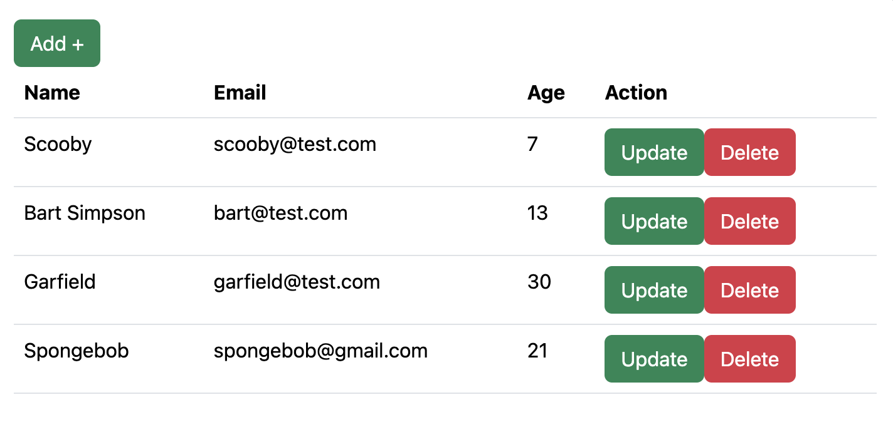
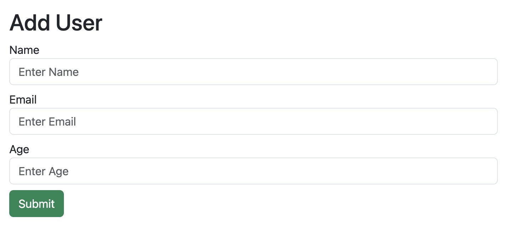

## CRUD app made in MERN stack

This repository contains a simple CRUD (Create, Read, Update, Delete) application built using the MERN (MongoDB, Express.js, React.js, Node.js) stack. The application allows users to perform basic CRUD operations on a collection of items containing name, email, and age.

## Features
- **Create new items with name, email, and age fields**
- **Read existing items**
- **Update existing items**
- **Delete existing items**

## Usage
- **Start the server: npm run dev **
- **Start the client: npm start **
